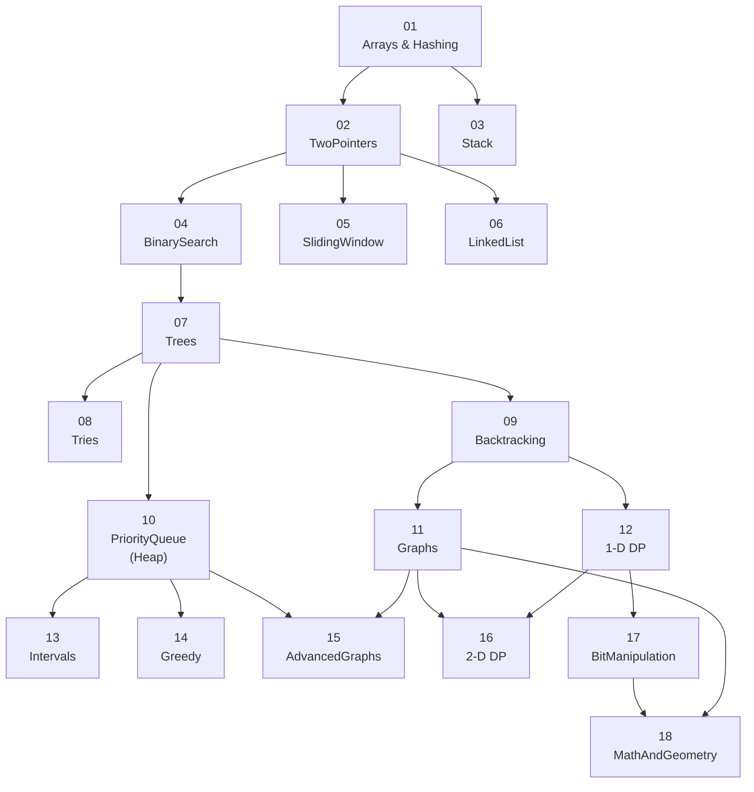

### Projects cover followings concepts

```mermaid
flowchart TB
  ArrayAndHashing["`01 <br> Arrays & Hashing`"]

  ArrayAndHashing --> TwoPointers["`02 <br> TwoPointers`"]
  ArrayAndHashing --> Stack["`03 <br> Stack`"]

  TwoPointers --> BinarySearch["`04 <br> BinarySearch`"]
  TwoPointers --> SlidingWindow["`05 <br> SlidingWindow`"]
  TwoPointers --> LinkedList["`06 <br> LinkedList`"]

  BinarySearch --> Trees["`07 <br> Trees`"]

  Trees --> Tries["`08 <br> Tries`"]
  Trees --> Backtracking["`09 <br> Backtracking`"]
  Trees --> PriorityQueue["`10 <br> PriorityQueue <br> (Heap)`"]

  PriorityQueue --> Intervals["`13 <br> Intervals`"]
  PriorityQueue --> Greedy["`14 <br> Greedy`"]
  PriorityQueue --> AdvancedGraphs["`15 <br> AdvancedGraphs`"]

  Backtracking --> Graphs["`11 <br> Graphs`"]
  Backtracking --> 1D-DP["`12 <br> 1-D DP`"]

  Graphs --> AdvancedGraphs
  Graphs --> 2D-DP["`16 <br> 2-D DP`"]

  1D-DP --> 2D-DP
  1D-DP --> BitManipulation["`17 <br> BitManipulation`"]

  BitManipulation --> MathAndGeometry
  Graphs --> MathAndGeometry["`18 <br> MathAndGeometry`"]
```